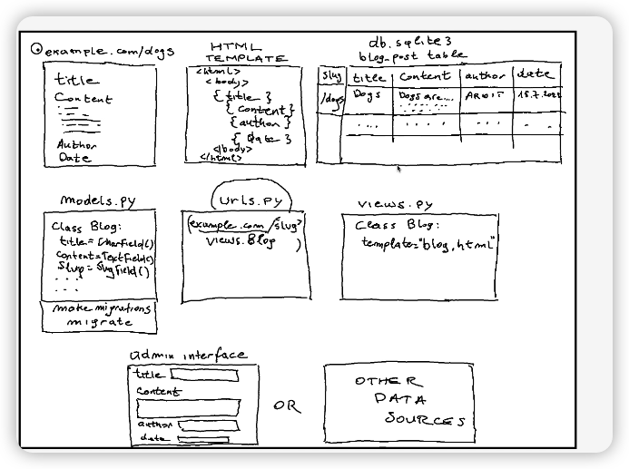

# How to create python virtual env

```bash
python -m venv env
```

# Django Versus Other Python Web Frameworks

- Flask
  - Usually it's for building small web application in a faster way
- Django
  - easy to communicate with database, suitable for bigger web app.
- JustPy
  - Allows you create web app without writing any CSS/HTML, that means you don't need to have front-end experience
  - suitable for small application

# Core Django concept

- Model: it's corresponding to table in DB
- View: Python functions or classes that receive a web request and return a web response
- HTML template: the code you write for website layer

## django-admin startproject mysite .

Initialize Django project

## python manage.py runserver

run Django server

## python manage.py migrate

create database table --> generate db.sqlite3 file in your local(dev usage)
You can use whatever database with your needs in production

## python manage.py createsuperuser

create admin user for site: http://localhost:8000/admin

## python manage.py startapp blog

create "blog" app

## python manage.py makemigrations

apply incremental change in Models, Run `python manage.py makemigrations` then re-run `manage.py migrate` to apply incremental change.

## 
