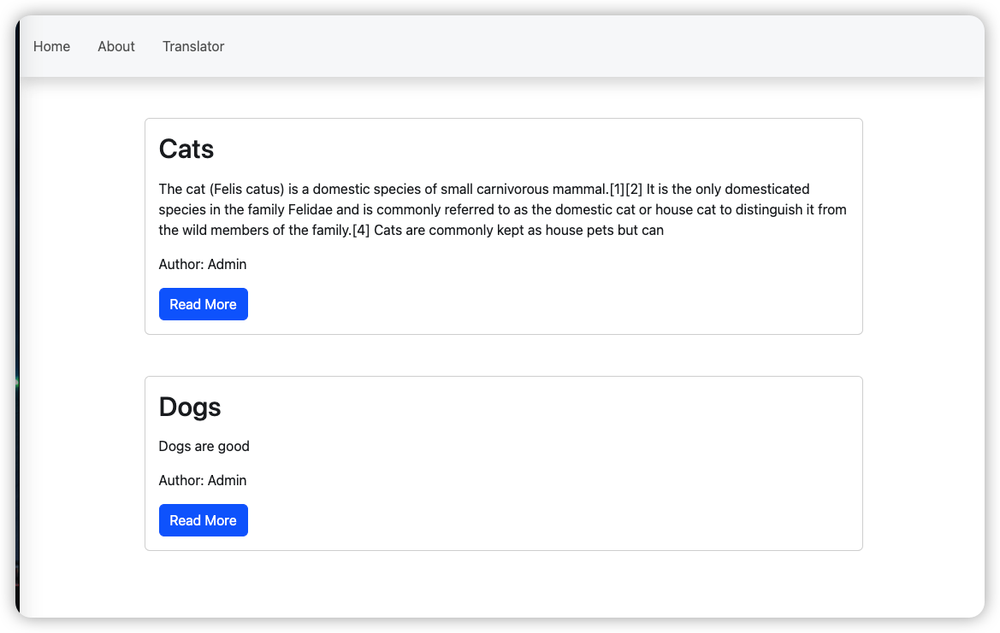

# Translator + blog micro system
This repo is a simple project to demonstrate basis of Django.

## Commands to start application

```bash
# install necessary dependency
pip install -r requirements.txt

# Run the application
python manage.py runserver
```

